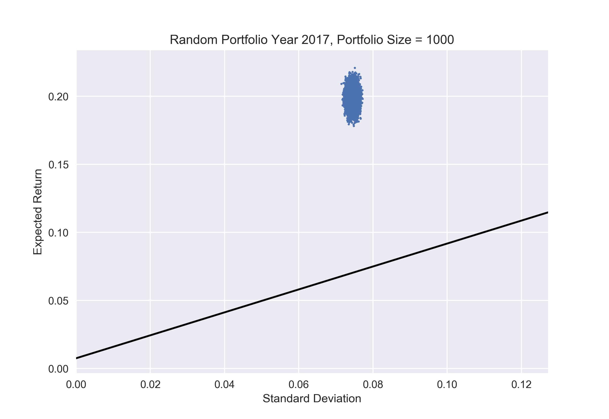
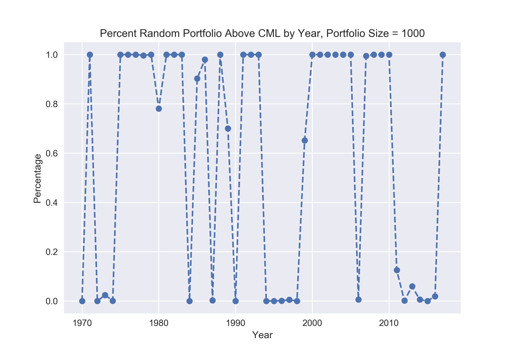

# CAPM-Validation
An analysis on paper **Market truths: theory versus empirical simulations** ([link to paper](https://www.researchgate.net/profile/James_Thompson7/publication/233041834_Market_truths_Theory_versus_empirical_simulations/links/545551580cf2cf51647dd427.pdf)) by *Wojciechowski, William C., and James R. Thompson*.

# Introduction
It is surprising that many well-accepted theories have not been adequately tested empirically. Under the assumptions of the Capital Asset Pricing Models (CAPM) as summarized in our TWF text in chapters 3 and 4, investors will only purchase efficient portfolios (in the Markowitz mean-variance sense). The uniform expectations assumptions ensure that the capital market line (CML) will be tangent to the Market Portfolio, and that any other portfolios must lie BELOW the efficient frontier.

# Data Selection
All data is from CRSP.
1. daily returns (vwretd) for NYSE/AMEX/NASDAQ/ARCA
2. top 1000 market cap stocks

# Results

# Conclusion
We were able to replicate Wojciechowski and Thompson’s results, finding that for most years there exists some random portfolios that beat the Capital Market Line. Further, there are many years, even when considering a large portfolio size, in which 100% of the random portfolios beat the CML. These portfolio results seem to contradict the Efficient Markets Hypothesis as well as the CAPM assumption that no portfolios exist beyond the Efficient Frontier which lies below the CML, except at a single tangent point.

An observation we made, which is also consistent with our intuition, is that economic instability/volatility seems to imply significant random variance in the return of the random portfolio. We also noted that during periods of severe recessionary environments, the ‘best’ ratio of risk/return may well lie on the CML.
